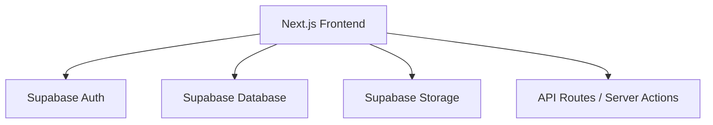

# WIP (Work-In-Progress) Workbench

A collaborative project management application designed for tracking daily tasks, milestones, and media updates in real-time. WIP provides a streamlined interface for developers and teams to showcase what they are working on through a unified timeline and media-rich dashboard.

## 🚀 Key Features

- **Real-time Timeline:** Track project updates and task completions in a chronological view.
- **Media-Rich Updates:** Upload and showcase progress images and videos directly within task entries.
- **Chat-Style Input:** Quickly add updates using a familiar, intuitive chat interface.
- **Date Filtering:** Easily navigate through historical updates using the integrated calendar filter.
- **Mobile Optimized:** Full PWA support with manifest and optimized icons for a native-like experience.

## 🏗️ Technical Architecture



**High-Level Flow:**
```
[ User Input ] ──> [ Chat Interface ] ──> [ Server Actions ]
                                                 │
                                         ┌───────┴───────┐
                                         │               │
                                 [ PostgreSQL ]   [ Media Storage ]
                                         │               │
[ Real-time Updates ] <────────── [ Supabase ] <─────────┘
```

## 🛠️ Tech Stack

- **Frontend:** Next.js (App Router), TypeScript, Tailwind CSS
- **Database/Auth:** Supabase
- **UI Components:** Shadcn/ui (Radix UI)
- **Icons:** Lucide React
- **PWA:** Manifest and Service Worker integration

## 🏃 How to Run

### Prerequisites
- Node.js 20+
- Supabase account with Storage and Database enabled

### Installation
```bash
# Clone the repository
git clone https://github.com/pavandongare/wip.git
cd wip

# Install dependencies
npm install
```

### Environment Setup
Create a `.env.local` file:
```
NEXT_PUBLIC_SUPABASE_URL=your_url
NEXT_PUBLIC_SUPABASE_ANON_KEY=your_key
```

### Development
```bash
# Run the development server
npm run dev
```

### Building for Production
```bash
# Build the project
npm run build

# Start production server
npm run start
```

---
Built with ❤️ by [Pavan Dongare](https://github.com/pavandongare)
